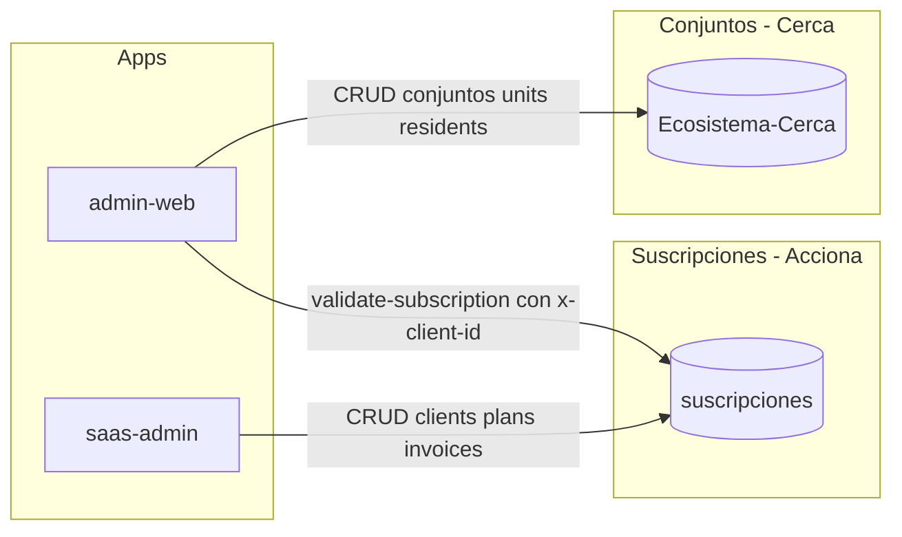
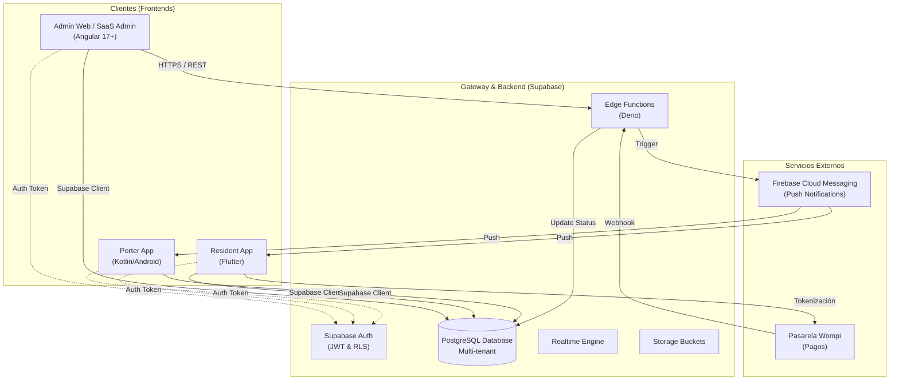
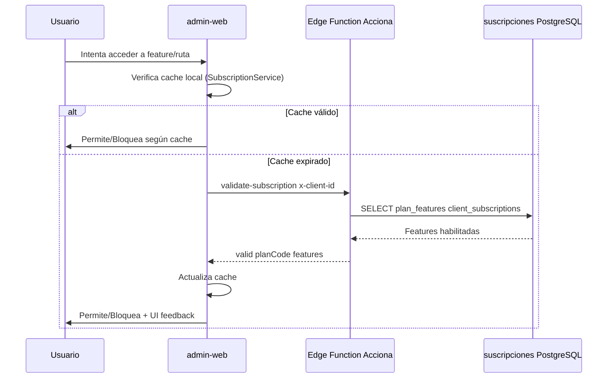

# Arquitectura Global del Ecosistema Cerca

Este documento define la arquitectura de alto nivel del ecosistema Cerca, detallando la interacción entre los diferentes clientes, el backend (Supabase) y los servicios externos.

## Proyectos Supabase (Dual-Project)

El ecosistema utiliza **dos proyectos Supabase** con responsabilidades separadas:

| Proyecto | Organización | Responsabilidad | App |
|----------|--------------|-----------------|-----|
| **suscripciones** | Acciona | Clientes, planes, facturación, billing | saas-admin |
| **Ecosistema-Cerca** | cerca | Conjuntos, unidades, residentes, citofonía, tesorería | admin-web |

admin-web obtiene `client_id` desde `conjuntos` (Ecosistema-Cerca) y valida la suscripción contra **suscripciones** (Acciona) vía Edge Function `validate-subscription`.

## Diagrama de Interacción del Sistema

## Componentes Principales

### 1. Sistema de Gestión de Suscripciones (SaaS Core)
Proyecto **suscripciones** (Acciona). Responsable de la lógica multi-tenant, planes y facturación del software.
-   **Base de Datos**: Esquema dedicado (`clients`, `plans`, `client_subscriptions`, `invoices`).
-   **Acceso**: Gestionado vía RLS basado en `client_id` (Tenant ID).
-   **App**: saas-admin.

### 2. Panel Administrativo (Angular)
Dos apps: **admin-web** (administradores de conjunto) y **saas-admin** (Súper Admin del SaaS).
-   **Tecnología**: Angular 17+ con Signals.
-   **admin-web**: Ecosistema-Cerca (datos operativos) + suscripciones/Acciona (validación de suscripción).
-   **saas-admin**: suscripciones/Acciona exclusivamente.

### 3. Aplicación de Residentes (Flutter)+

Punto de contacto para los copropietarios.
-   **Tecnología**: Flutter.
-   **Offline-first**: Sincronización de datos críticos (facturas, noticias) para acceso sin conexión.
-   **Pagos**: Integración con Wompi para pago de administración.

### 4. Aplicación de Portería (Kotlin)
Herramienta de control de acceso y seguridad física.
-   **Tecnología**: Nativo Android (Kotlin).
-   **Hardware**: Integración directa con lectores NFC, Biometría y Cámaras.

### 5. Control de Acceso SaaS (Security Gateway)

El sistema utiliza un flujo de validación en tres capas para garantizar que los usuarios solo accedan a lo que su plan permite:

## Flujo de Datos
1.  **Multi-tenancy**: Todas las consultas a la base de datos deben incluir el `tenant_id` (o `client_id`) en el contexto de la sesión o en la consulta explícita, forzado por políticas RLS.
2.  **Seguridad**:
    -   Autenticación vía Supabase Auth.
    -   Autorización vía RLS en PostgreSQL.
    -   Secretos gestionados en Supabase Vault / Environment Variables.
