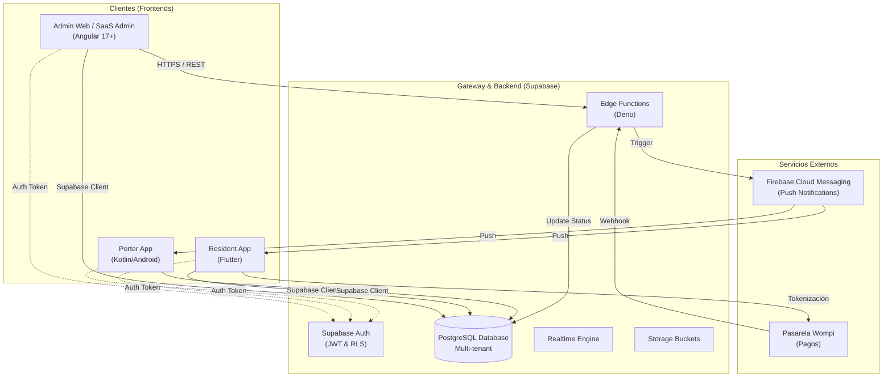

# Arquitectura Global del Ecosistema Cerca

Este documento define la arquitectura de alto nivel del ecosistema Cerca, detallando la interacción entre los diferentes clientes, el backend (Supabase) y los servicios externos.

## Diagrama de Interacción del Sistema

## Componentes Principales

### 1. Sistema de Gestión de Suscripciones (SaaS Core)
Responsable de la lógica multi-tenant, planes y facturación del software.
-   **Base de Datos**: Esquema dedicado (`clients`, `plans`, `invoices`).
-   **Acceso**: Gestionado vía RLS basado en `client_id` (Tenant ID).

### 2. Panel Administrativo (Angular)
Interfaz para administradores de conjunto y "Súper Admin" del SaaS.
-   **Tecnología**: Angular 17+ con Signals.
-   **Comunicación**: Directa con Supabase y Edge Functions para lógica de negocio compleja (ej. cierre de mes).

### 3. Aplicación de Residentes (Flutter)
Punto de contacto para los copropietarios.
-   **Tecnología**: Flutter.
-   **Offline-first**: Sincronización de datos críticos (facturas, noticias) para acceso sin conexión.
-   **Pagos**: Integración con Wompi para pago de administración.

### 4. Aplicación de Portería (Kotlin)
Herramienta de control de acceso y seguridad física.
-   **Tecnología**: Nativo Android (Kotlin).
-   **Hardware**: Integración directa con lectores NFC, Biometría y Cámaras.

## Flujo de Datos
1.  **Multi-tenancy**: Todas las consultas a la base de datos deben incluir el `tenant_id` (o `client_id`) en el contexto de la sesión o en la consulta explícita, forzado por políticas RLS.
2.  **Seguridad**:
    -   Autenticación vía Supabase Auth.
    -   Autorización vía RLS en PostgreSQL.
    -   Secretos gestionados en Supabase Vault / Environment Variables.
