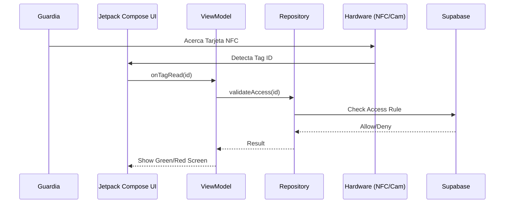

# Arquitectura App Portería (Kotlin)

Este documento define la arquitectura técnica para la aplicación de portería (`porter-app`).

## Estrategia Tecnológica
-   **Plataforma**: Android Nativo.
-   **Lenguaje**: **Kotlin 2.0**.
-   **UI**: Jetpack Compose.
-   **Arquitectura**: MVVM + Clean Architecture.

## Componentes de Hardware

### 1. Lectura NFC (Control de Acceso)
Uso de `NfcAdapter` para leer tags de residentes o tarjetas de visitantes.
-   Lectura en modo "Reader Mode" para priorizar la app.
-   Validación contra base de datos local (para acceso rápido) o remota.

### 2. Biometría
Uso de `BiometricPrompt` API para autenticar al guardia o validaciones de seguridad adicionales.

### 3. Cámara (OCR / QR)
Uso de CameraX para esaneo de documentos de identidad o códigos QR de invitación.

## Comunicación con Backend (Supabase)
Aunque es nativo, se recomienda usar:
-   **Ktor Client**: Para peticiones HTTP REST a Edge Functions.
-   **Supabase Kt**: Cliente comunitario de Kotlin para Supabase (si es viable) o llamadas REST directas.
-   **Coroutines & Flow**: Manejo asíncrono obligatorio para no bloquear el hilo principal (UI).

## Diagrama de Comunicación Interna

