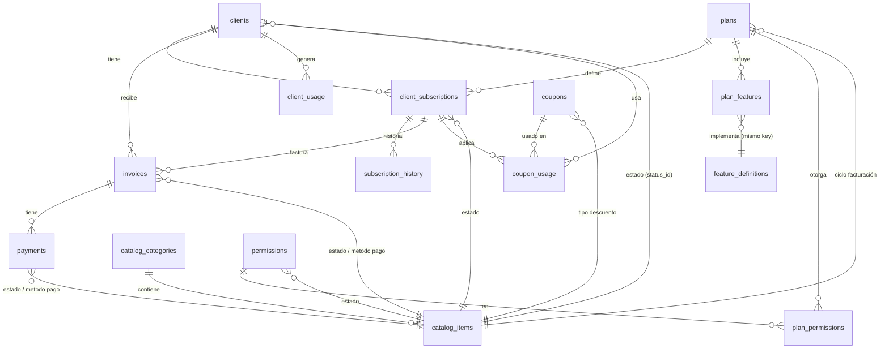

# Documentación Técnica: Módulo de Suscripciones (SaaS Admin)

## 1. Alcance y Estado Actual del Proyecto

El proyecto **SaaS Admin - Módulo de Suscripciones** tiene como objetivo implementar la gestión completa del ciclo de vida de las suscripciones para los conjuntos residenciales (clientes) de Cerca Ecosystem.

### Alcance
El sistema permite a los administradores de Cerca:
- **Gestión de Catálogos:** Administrar categorías y elementos de configuración (estados, tipos de pago, etc.).
- **Gestión de Planes:** Definir planes de servicio con sus precios, ciclos de facturación y características.
- **Gestión de Clientes:** Registrar y administrar los conjuntos residenciales.
- **Suscripciones:** Asignar planes a clientes y gestionar su estado (activo, suspendido, cancelado).
- **Facturación:** Generar facturas y registrar pagos (integración futura con pasarelas).
- **Control de Acceso:** Gestionar usuarios administradores y sus permisos basados en roles.
- **Seguridad:** Implementación robusta de Row Level Security (RLS) en Supabase para aislamiento de datos.

### Estado Actual (a la fecha)
El proyecto se encuentra en una fase avanzada de implementación (**Fase de Verificación y Ajustes**).

- **Backend (Supabase):**
    - [x] Esquema de base de datos definidos.
    - [x] Políticas RLS aplicadas y corregidas (incluyendo solución a recursión infinita en `admin_users`).
    - [x] Tablas principales operativas: `clients`, `plans`, `subscriptions`, `invoices`, `payments`.
    - [x] **Verificación de Integridad:** Se ha validado que las 16 tables existentes en el esquema `public` están documentadas y corresponden con la implementación actual (Fecha: 2026-02-10).

- **Frontend (Angular - SaaS Admin):**
    - [x] Arquitectura base implementada (Standalone Components, Signals).
    - [x] Módulo de Acceso (Usuarios y Permisos) completado.
    - [x] Módulo de Catálogos (Categorías e Items) completado.
    - [x] Módulo de Billing (Cupones) completado.
    - [x] Módulo de Suscripciones (Listados y Auditoría) en revisión.
    - [x] Corrección de errores de construcción y relaciones en servicios (`admin-subscription.service.ts`).

## 2. Listado de Tablas (Base de Datos)

A continuación se listan las tablas existentes en el esquema `public` de la base de datos `suscripciones`:

| Nombre de Tabla | Descripción |
| :--- | :--- |
| `admin_users` | Usuarios con acceso al panel administrativo SaaS. Define roles (`super_admin`, `billing_admin`, `viewer`) y se vincula con `auth.users`. |
| `catalog_categories` | Agrupador maestro para los ítems del catálogo (ej. `subscription_status`, `payment_methods`). Asegura la integridad de los tipos de datos. |
| `catalog_items` | Diccionario de datos del sistema. Contiene los valores permitidos para estados, tipos y configuraciones. Clave para la normalización. |
| `client_subscriptions` | Tabla pivote central. Vincula `clients` con `plans`. Gestiona el ciclo de vida (fechas, auto-renovación, período de prueba) y estado de la suscripción. |
| `client_usage` | Control de consumo de recursos (ej. número de usuarios activos, almacenamiento). Permite aplicar los límites definidos en el plan. |
| `clients` | Entidad principal del cliente (Conjunto Residencial). Almacena datos de contacto y estado comercial. |
| `coupon_usage` | Registro de auditoría de redención de cupones. Evita el abuso de promociones limitadas por cliente o totales. |
| `coupons` | Motor de descuentos. Configura códigos promocionales, tipos de descuento (porcentaje/monto), vigencia y límites. |
| `feature_definitions` | Catálogo maestro de características funcionales. Define el `key` (ej. `max_users`), etiqueta y tipo de dato esperado. |
| `invoices` | Documentos de cobro generados. Contiene montos, impuestos, fechas de vencimiento y estado de pago. Histórico financiero inmutable. |
| `payments` | Registro de transacciones monetarias asociadas a una factura. Soporta múltiples intentos y métodos de pago. |
| `permissions` | Catálogo de capacidades del sistema (rutas, módulos). Define qué se puede hacer en la plataforma. |
| `plan_features` | Configuración específica de un plan. Asigna valores concretos a las `feature_definitions` para un plan dado (ej. Plan Básico -> max_users = 100). |
| `plan_permissions` | Tabla de relación que asigna capacidades (`permissions`) a un plan. Define qué módulos ve el cliente según su plan. |
| `plans` | Definición comercial del producto. Establece precios, ciclos de facturación, y límites base. |
| `subscription_history` | Auditoría completa de cambios en suscripciones. Registra quién cambió qué, cuándo y por qué (trazabilidad). |

## 3. Modelo Entidad-Relación (ER)

El siguiente diagrama muestra las relaciones clave entre las tablas del sistema, basado en las claves foráneas definidas.

## 4. Flujos de Suscripción Futuros (Roadmap)

### Opción 2: Formulario Externo (Landing Page)
**Objetivo:** Permitir el auto-registro de nuevos clientes.
- **Flujo:**
  1. Cliente selecciona un plan en la Landing Page.
  2. Completa formulario de registro (Nombre Conjunto, Contacto, Admin).
  3. Sistema crea `client`, `admin_user` y `client_subscription` (estado: `pendiente` o `active` si hay pago).
  4. Redirección al pago o dashboard.

### Opción 3: Formulario en Admin-Web (Renovación/Upgrade)
**Objetivo:** Permitir al cliente gestionar su propia suscripción.
- **Flujo:**
  1. Admin del conjunto ingresa a "Mi Suscripción" en `admin-web`.
  2. Visualiza plan actual y opciones de upgrade/downgrade.
  3. Selecciona nuevo plan o ciclo.
  4. Sistema genera `invoice` y redirige a pasarela de pago.
  5. Al confirmar pago, webhook actualiza `client_subscription` y registra `subscription_history`.

### Opción 4: Integración Pasarela de Pagos (Wompi)
**Objetivo:** Automatizar el recaudo y conciliación.
- **Flujo:**
  1. Generación de referencia de pago única por factura.
  2. Implementación de Webhook para recibir confirmación de transacción (Aprobada/Rechazada).
  3. **Seguridad:** Validación de firma de integridad (Checksum) para evitar fraudes.

### Opción 5: Automatización de Estados (Cron Jobs)
**Objetivo:** Mantener la integridad del servicio sin intervención manual.
- **Tareas Programadas:**
  - **Vencimiento:** Marcar como `Suspendida` (Status ID: 9) las suscripciones vencidas sin pago (Grace Period: 5 días).
  - **Recordatorios:** Enviar emails de cobro 5 y 1 día antes del vencimiento.
  - **Pruebas:** Transición automática de `En Prueba` (Status ID: 10) a `Suspendida` si no hay conversión a pago al día 15.
